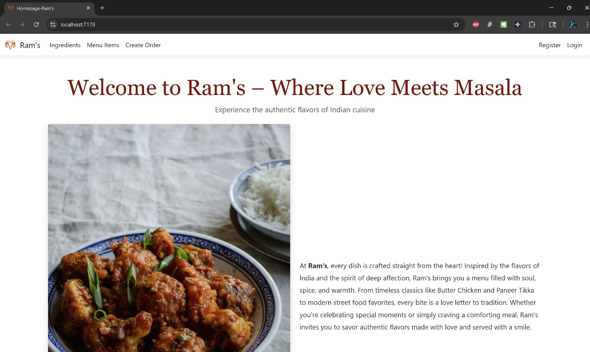
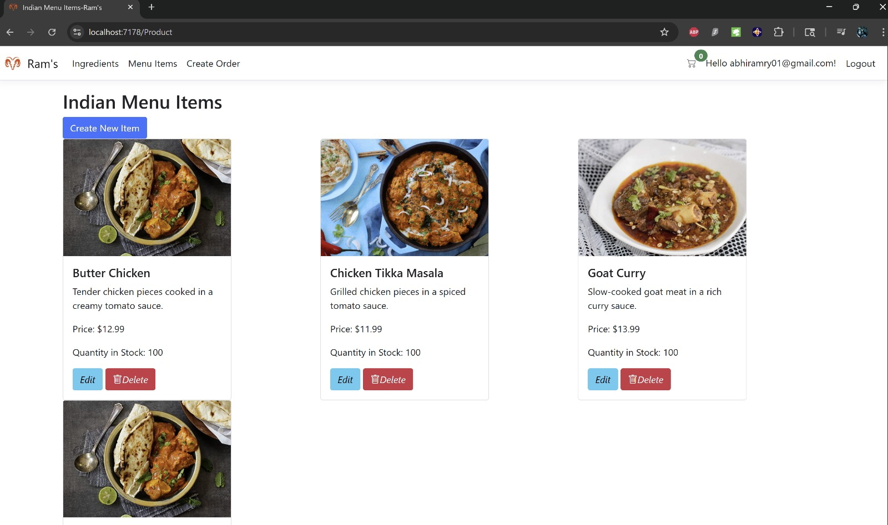
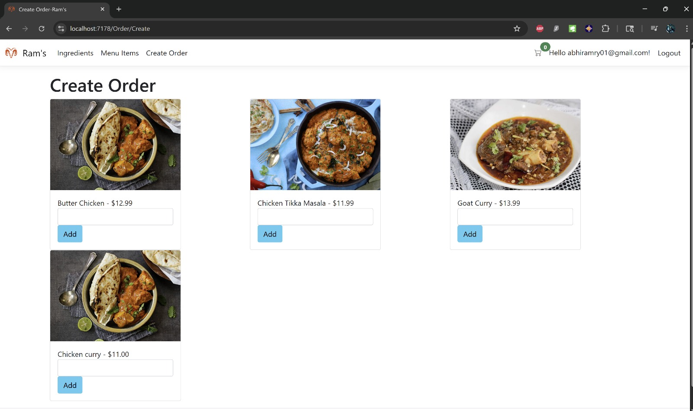
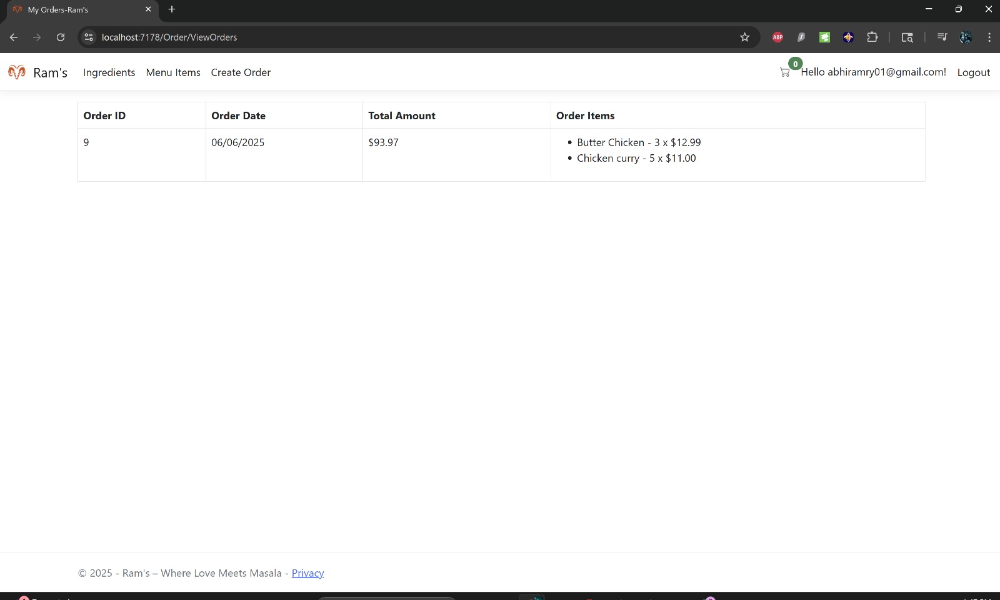

# ram-restaurant

A full-stack ASP.NET Core Razor Pages web application for restaurant e-commerce, featuring menu management, user authentication, session-based cart tracking, and database integration using Entity Framework Core. The project is styled with Bootstrap and demonstrates dependency injection, database relationships, and dynamic Razor views.
 ## Demo

   
   
   
   
   
## Features

- User registration and authentication
- CRUD operations for menu items and ingredients
- Shopping cart with session tracking
- Responsive UI with Bootstrap
- Entity Framework Core (Code-First) with SQL Server/LocalDB
- Hosted on Azure Web App Services (optional)

## Technologies Used

- C#
- ASP.NET Core (.NET 8, Razor Pages)
- Entity Framework Core
- SQL Server / LocalDB
- Bootstrap
- Dependency Injection
- Session Management